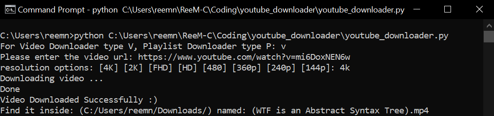

# YouTube Video Downloader

<div align="center">
  <a href="https://github.com/ReemNawaf/youtube_video_downloader">
    
  </a>

<h3 align="center">Youtube Video Downloader</h3>

  <p align="center">
    python project to download any YouTube video or playlist in any available resolution (including FHD and 4k).
    
</div>


<!-- TABLE OF CONTENTS -->
<details>
  <summary>Table of Contents</summary>
  <ol>
    <li><a href="#used-python-libraries">Used Python Libraries</a></li>
    <li><a href="#requisites">Requisites</a></li>
    <li><a href="#features">Usage</a></li>
    <li><a href="#contact">Contact</a></li>
  </ol>
</details>

### Used Python Libraries

* [pytube](https://pytube.io/en/latest/)
* [ffmpeg](https://www.ffmpeg.org/)

### Requisites
Besides insatalling python 3, make sure pip package is installed too.

* pytube library
  ```sh
  pip install pytube
  ```
* ffmpeg library
  ```sh
  pip install ffmpeg-python
  ```

## Features
* Download any youtube video in any resoution including 4k.
* Download an entire youtube playlist with one click
* Open the video after downloading it

<div align="center">
  <a href="https://github.com/ReemNawaf/youtube_video_downloader">
    
  </a>
  <a href="https://github.com/ReemNawaf/youtube_video_downloader">
    
  </a>

<!-- CONTACT -->
## Contact

Reem Almutairi - [@ReemNawaf](https://twitter.com/ReemNawaf) - reem.naw@gmail.com
Project Link: [https://github.com/ReemNawaf/youtube_video_downloader](https://github.com/ReemNawaf/youtube_video_downloader)
